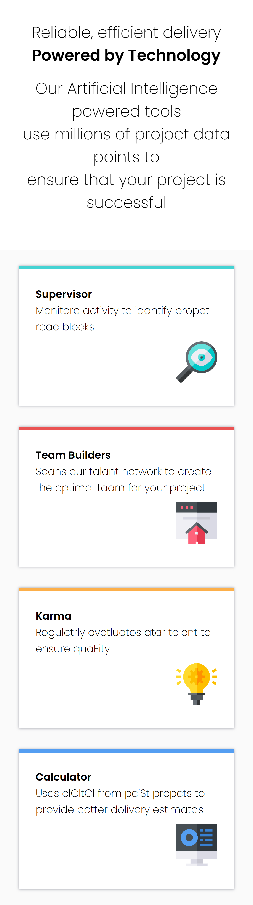

# Frontend Mentor - Four card feature section solution

This is a solution to the [Four card feature section challenge on Frontend Mentor](https://www.frontendmentor.io/challenges/four-card-feature-section-weK1eFYK). Frontend Mentor challenges help you improve your coding skills by building realistic projects.

## Table of contents

- [Overview](#overview)
  - [The challenge](#the-challenge)
  - [Desktop result](#desktop)
  - [Smartphone result](#smartphone)
  - [Links](#links)
- [My process](#my-process)
  - [Built with](#built-with)
  - [Useful resources](#useful-resources)
- [Author](#author)

---

## Overview

### The challenge

Users should be able to:

- View the optimal layout for the site depending on their device's screen size

### Desktop

## Smartphone

### Links

- [Live Demo](https://four-card-feature-section-challenge-six.vercel.app/)
- [Source code](https://github.com/DruckDeveloper/Four-card-feature-section-challenge)

## My process

### Built with

- Semantic HTML5 markup
- SASS
- Flexbox
- CSS Grid
- Mobile-first workflow
- [Vite](https://vitejs.dev/)

### Useful resources

- [A Complete Guide to CSS Grid](https://css-tricks.com/snippets/css/complete-guide-grid/) - This helped me to understand all concepts about CSS Grid layout and how to use gird areas.

## Author

- Frontend Mentor - [@DruckDeveloper](https://www.frontendmentor.io/profile/DruckDeveloper)
